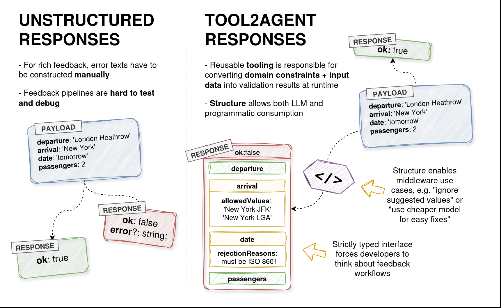

# tool2agent

## About

tool2agent is a protocol that enables LLM agents to navigate complex business constraints via trial and error by communicating rich and structured feedback data from tools.

Real-world domain constraints are complex, dynamic and non-publicly-known - in other words, can't be fed into an LLM context. tool2agent defines rules for producing structured errors and suggestions, that give an agent enough context to iteratively improve on its request, until the goal is achieved.

Technically speaking, tool2agent is just a number of schemas that allow to structure tool call feedback flows in a predictable manner.



## Problems and solutions

### Tool schemas are not enough

Tool schemas alone are often not sufficient to convey enough information about expected inputs, so error-and-retry LLM workflows are needed.

A good feedback system + a very primitive schema may be better than a complex schema with precisely encoded variants, even though it would be taking more tool calls. This is especially true in contexts where there is no way to encode domain constraints in the schema or the system prompt.

tool2agent suggests schema discovery on the fly and encourages the developers to build rich tool feedback systems.

### Hard to maintain separation of concerns when building agents

Sometimes developers "leak" domain constraints into prompts to guide the model towards producing better tool call payloads, which bloats the context and erodes separation of concerns.

Domain constraints should better be presented to the LLM context "on demand", because naturally all LLMs have a limit to the number of rules they can follow before prompt amnesia starts to kick in.

With tool2agent, domain constraints can be actualized on the fly, as opposed to them being included in the prompt. This allows them to be kept private and be dynamic (change while the inference is in progress).

### Tool schemas consume tokens even when not used

Precise tool schemas occupy a lot of input tokens.

In the context of agentic workflows, most tool will not be called, so there is no reason for the LLM to be aware of their precise schemas.

tool2agent-enabled workflows consume much less tokens (but require more tool calls for trial and feedback).

### Tool feedback machinery reuse requires additional engineering

Although there are common LLM tool response validation patterns (beyond schemas), in a real application they may not be turned into reusable code, because that would require additional engineering efforts.

Structuring the way information flows from tools to LLM allows for programmatic transformation of that data, e.g. in the form of reusable middleware.

## Specification

Right now, the specification is expressed as Typescript types: [here](./src/spec.ts), also available on NPM:

```bash
pnpm i tool2agent
```

## How do I use it?

The specification itself only makes sense for those who develop tool2agent-enabled machinery, NOT agent developers.

Agent developers should use
